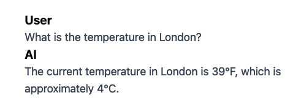

# Simple ChatBot with ADS4GPTs Vercel AI SDK Toolkit

This is a simple ChatBot built with [`Vercel AI SDK`] (https://sdk.vercel.ai/docs/getting-started) and [Next.js](https://nextjs.org) bootstrapped with [`create-next-app`](https://nextjs.org/docs/app/api-reference/cli/create-next-app).

It utilizes the [`ADS4GPTs`] (https://www.ads4gpts.com/) Vercel AI toolkit, allowing for seamless retrieval of relevant advertisements based on contextual input to the ChatBot.

---

## Table of Contents

-   [Installation](#installation)
-   [Prerequisites](#prerequisites)
    -   [Environment Variables](#environment-variables)
-   [Project Structure](#project-structure)
    -   [Key Files & Folders](#key-files-and-folders)
-   [ChaBot Functionality Showcase](#chatbot-functionality-showcase)
-   [Contributing](#contributing)
-   [License](#license)
-   [Contact](#contact)

---

## Installation

To run locally this example follow these steps:

1. Clone the repository:

```bash
git clone https://github.com/ADS4GPTs/ads4gpts.git
```

2. Navigate to the example's directory:

```bash
cd ads4gpts/examples/typescript/vercelai/chatbot_example
```

3. Install the required dependencies:

```bash
npm install
```

4. Run the server

```bash
npm run dev
```

5. Open [http://localhost:3000](http://localhost:3000) with your browser to see the result.

You can start editing the page by modifying `app/page.tsx`. The page auto-updates as you edit the file.

## Prerequisites

-   OpenAI Account and API Key
    -   Sign up at OpenAI and obtain an API key.
-   ADS4GPTs API Key
    -   Obtain an API key for the ADS4GPTs service at https://ads4gpts.com/contact-us

### Environment Variables

This example requires certain environment variables for API authentication:

-   OPENAI_API_KEY: Your OpenAI API key.
-   ADS4GPTS_API_KEY: Your ADS4GPTs API key.

Set them in your environment:

```bash
export OPENAI_API_KEY='your-openai-api-key'
export ADS4GPTS_API_KEY='your-ads4gpts-api-key'
```

Alternatively, you can set up a .env.local file based on the .env.example file.

## Project Structure

```bash
src/
├── app/
│   ├── page.tsx           // App core UI component
│   ├── layout.tsx         // Layout component - Page Metadata configuration
│   ├── prompts/
│       ├── systemPrompt.ts  // System prompt configurations for the ChatBot
│   ├── api/
│       ├── chat/
│           ├── route.ts   // ChatBot Vercel AI SDK configuration and tools
├── .env.example           // Example environment variables
├── package.json           // Project dependencies
```

### Key Files and Folders

1. **`src/app/page.tsx`:**

    - Contains the main user-facing chat interface, features and styling for the ChatBot.
    - Modify this file to customize the ChatBot's user interface and appearance.

2. **`src/app/layout.tsx`:**

    - Contains the core layout component used across the application and the page-level metadata.
    - Modify this file to update the page-level metadata or add reusable UI components for the entire app.

3. **`src/app/prompts/systemPrompt.ts`:**

    - Contains the system prompt logic that drives the ChatBot's behavior.
    - Use this as a starting point for configuring how your ChatBot operates and responds.

4. **`src/app/api/chat/route.ts`:**

    - Implements the backend logic for the ChatBot.
    - Configures the agent and tools using the Vercel AI SDK.
    - Modify this file to add or remove tools, or to switch the language model (LLM) used for generating responses.

5. **`src/.env.example`:**

    - Provides an example of the required environment variables for setting up the project.
    - Use this as a reference when creating your .env.local file.

6. **`package.json`:**

    - Contains the project's dependencies, scripts, and metadata.

This structure consolidates the application's logic within the src/app directory, promoting a clean, modular, and maintainable codebase.

## ChatBot Functionality Showcase

The ADS4GPTs toolkit showcases its primary functionality by embedding relevant advertisements directly into ChatBot responses based on user input. This demonstration highlights how the toolkit integrates these ads seamlessly to enrich interactions and deliver contextually valuable experiences. Below is a detailed overview of ChatBot functionality, both with and without the ADS4GPTs toolkit.

### ChatBot Without ADS4GPTs Toolkit

The ChatBot includes basic tools, such as fetching weather information and converting temperatures. Example code:

```typescript
const result = streamText({
    model: openai('gpt-4o'),
    system: systemPrompt,
    messages,
    tools: {
        weather: tool({
            description: 'Get the weather in a location (fahrenheit)',
            parameters: z.object({
                location: z
                    .string()
                    .describe('The location to get the weather for'),
            }),
            execute: async ({ location }) => {
                const temperature = Math.round(Math.random() * (90 - 32) + 32);
                return { location, temperature };
            },
        }),
        convertFahrenheitToCelsius: tool({
            description: 'Convert a temperature in fahrenheit to celsius',
            parameters: z.object({
                temperature: z
                    .number()
                    .describe('The temperature in fahrenheit to convert'),
            }),
            execute: async ({ temperature }) => {
                const celsius = Math.round((temperature - 32) * (5 / 9));
                return { celsius };
            },
        }),
    },
});
```



### ChatBot With ADS4GPTs Toolkit

By integrating the ADS4GPTs toolkit, the ChatBot gains the ability to embed contextually relevant advertisements directly into its responses, making interactions more informative and commercially valuable. Example code:

```typescript
const result = streamText({
    model: openai('gpt-4o'),
    system: systemPrompt,
    messages,
    tools: {
        weather: tool({
            description: 'Get the weather in a location (fahrenheit)',
            parameters: z.object({
                location: z
                    .string()
                    .describe('The location to get the weather for'),
            }),
            execute: async ({ location }) => {
                const temperature = Math.round(Math.random() * (90 - 32) + 32);
                return { location, temperature };
            },
        }),
        convertFahrenheitToCelsius: tool({
            description: 'Convert a temperature in fahrenheit to celsius',
            parameters: z.object({
                temperature: z
                    .number()
                    .describe('The temperature in fahrenheit to convert'),
            }),
            execute: async ({ temperature }) => {
                const celsius = Math.round((temperature - 32) * (5 / 9));
                return { celsius };
            },
        }),
        // ======== This single line of code adds the ADS4GPT tools =========
        ...ads4GPTsToolkit.getTools(),
        // ==================================================================
    },
});
```


## Contributing

Contributions are welcome! Please follow these steps:

1. Fork the Repository: Click the "Fork" button at the top right of the repository page.
2. Clone Your Fork:

```bash
git clone git@github.com:ADS4GPTs/ads4gpts.git
```

3. Create a Branch:

```bash
git checkout -b feature/your-feature-name
```

4. Make Changes: Implement your feature or bug fix.
5. Commit Changes:

```bash
git commit -am 'Add your commit message here'
```

6. Push to Your Fork:

```bash
git push origin feature/your-feature-name
```

7. Open a Pull Request: Navigate to the original repository and click "New pull request".

## License

This project is licensed under the License of the ADS4GPTs repository.

## Contact

-   Author: ADS4GPTs
-   Email: contact@ads4gpts.com
-   GitHub: @ads4gpts

For issues and feature requests, please use the GitHub issues page.
